# MonsoonRoute 🌧️🗺️

> **A rain-aware route decision system for Mumbai commuters.**
>
> MonsoonRoute compares available routes using rainfall, route geometry, source-backed waterlogging evidence, and travel-time trade-offs — then recommends the better practical route.

[](#)
[](#)
[](#)
[](#)

---

## Table of Contents

- [Why MonsoonRoute?](#why-monsoonroute)
- [What It Does](#what-it-does)
- [What It Is Not](#what-it-is-not)
- [Core Architecture](#core-architecture)
- [The Two Runtime Paths](#the-two-runtime-paths)
- [End-to-End Decision Flow](#end-to-end-decision-flow)
- [Route and Weather Pipeline](#route-and-weather-pipeline)
- [Waterlogging Intelligence](#waterlogging-intelligence)
- [Risk and Decision Model](#risk-and-decision-model)
- [Recommendation and Evidence](#recommendation-and-evidence)
- [AI Explanation Layer](#ai-explanation-layer)
- [Frontend Architecture](#frontend-architecture)
- [Data Model and Geographic Scope](#data-model-and-geographic-scope)
- [API](#api)
- [Technology Stack](#technology-stack)
- [Project Structure](#project-structure)
- [Getting Started](#getting-started)
- [Environment Variables](#environment-variables)
- [Google API and Cost Protection](#google-api-and-cost-protection)
- [Testing Strategy](#testing-strategy)
- [Implementation Roadmap](#implementation-roadmap)
- [Demo Flow](#demo-flow)
- [Limitations and Safety](#limitations-and-safety)
- [Documentation](#documentation)
- [Acknowledgements and Attribution](#acknowledgements-and-attribution)

---

## Why MonsoonRoute?

During Mumbai rain, the fastest available route is not necessarily the route with the lower estimated environmental exposure.

A commuter should be able to answer:

> **"Which available route gives me the better trade-off between travel time and monsoon-related exposure?"**

MonsoonRoute is designed around that question.

It does **not** try to replace Google Maps, predict flooding with machine learning, or ask an LLM to decide the route.

Instead:

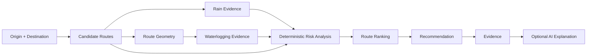

The central architectural rule is:

> **The deterministic engine makes the decision. The AI explains the decision.**

---

# What It Does

A commuter provides:

- origin
- destination
- travel mode
- departure time

The system then:

1. obtains available candidate routes;
2. normalizes their geometry and travel times;
3. obtains hourly rainfall information for each route;
4. evaluates route geometry against the unified waterlogging dataset;
5. calculates waterlogging risk;
6. calculates rain risk;
7. combines environmental exposure with travel-time cost;
8. ranks the available routes;
9. selects a recommendation;
10. generates structured evidence explaining the recommendation;
11. optionally asks an AI agent to turn that existing evidence into natural language.

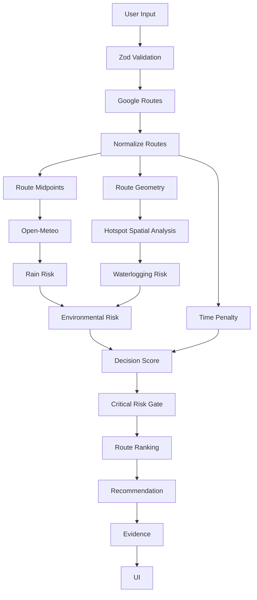

---

# What It Is Not

MonsoonRoute intentionally stays narrow.

It is **not**:

- a weather dashboard;
- a flood-probability model;
- a Google Maps replacement;
- a traffic predictor;
- an AI route planner;
- a nationwide climate platform;
- a crowdsourcing/social platform;
- an emergency-response platform;
- a multi-agent system;
- a route-history product;
- a notification platform;
- an account/authentication product;
- an ML flood-prediction system.

This narrow scope is deliberate: the product exists to demonstrate a clear, explainable route-decision workflow.

---

# Core Architecture

MonsoonRoute uses a single Next.js application containing both the frontend and backend.

There is:

- no Express server;
- no Rust service;
- no database;
- no Redis;
- no queue;
- no microservice layer;
- no background worker;
- no AWS cloud infrastructure required for the application.

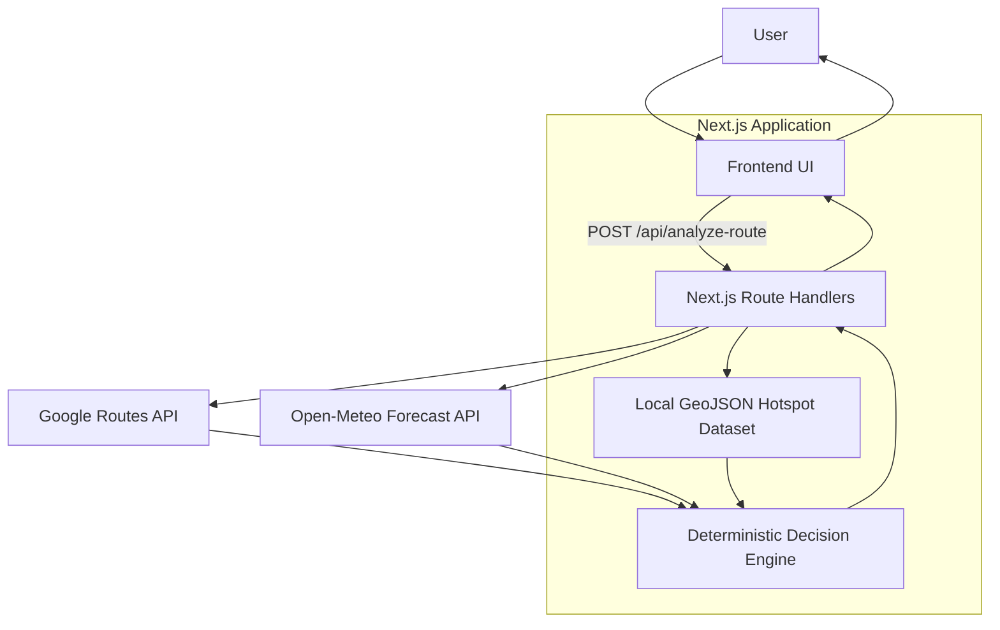

## Why one application?

The hackathon architecture is intentionally simple:

- Next.js serves the UI.
- Next.js Route Handlers serve the backend API.
- The deterministic engine runs server-side.
- GeoJSON is bundled as local application data.
- AI is an optional server-side explanation path.

No infrastructure is introduced merely to make the architecture look larger.

---

# The Two Runtime Paths

MonsoonRoute has two deliberately separated runtime paths.

## 1. Mandatory decision path

This path decides the route.

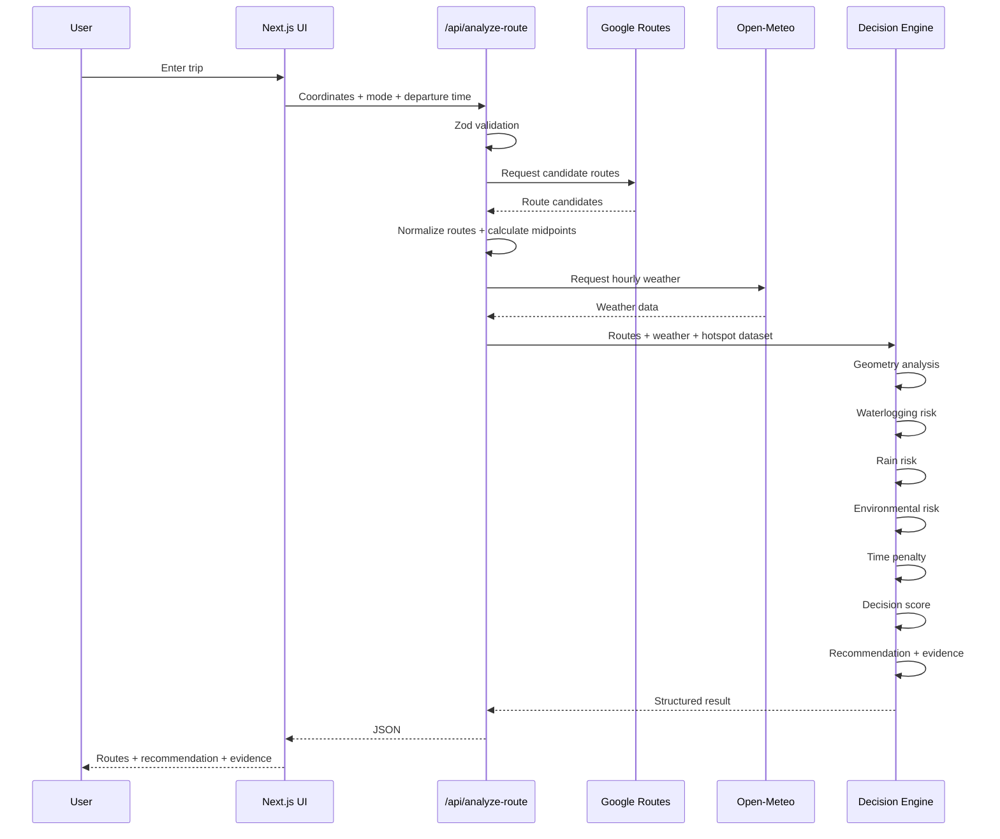

**No AI is called anywhere in this path.**

---

## 2. Optional explanation path

This path exists only after the user has a recommendation and explicitly clicks **Explain this decision**.

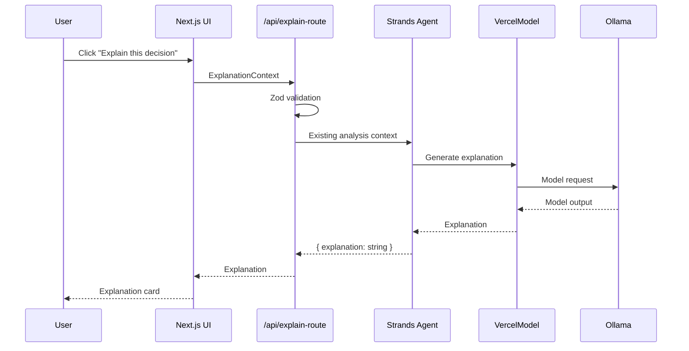

The explanation endpoint does **not** call:

- Google Routes;
- Open-Meteo;
- the risk engine;
- the recommendation engine;
- route-ranking logic.

---

# End-to-End Decision Flow

The complete product flow is:

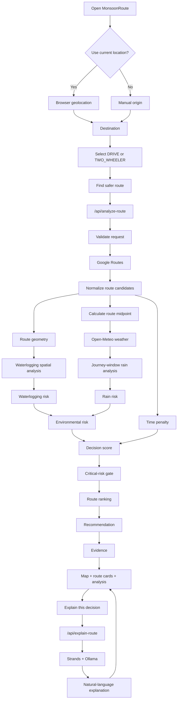

---

# Route and Weather Pipeline

## Candidate routes

Google Routes supplies the feasible route alternatives.

MonsoonRoute does not assume that Google will always return a fixed number of routes.

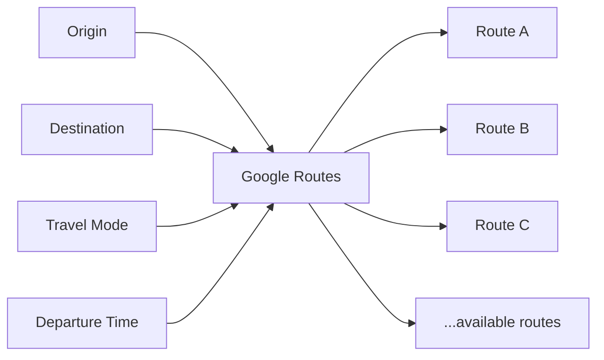

Each route is normalized into the application's own `Route` representation:

```text
Route
├── id
├── label
├── durationSeconds
├── distanceMeters
├── GeoJSON LineString
└── optional viewport
```

Google-specific response structures do not leak into the frontend.

---

## Route geometry

Route geometry is first-class because it is required for waterlogging analysis.

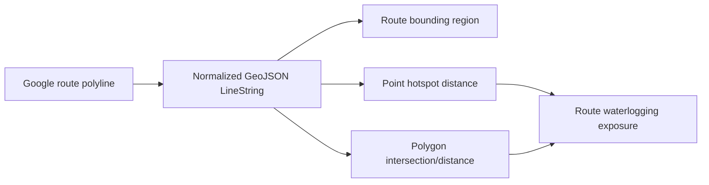

GeoJSON coordinates remain `[longitude, latitude]`.

The map may transform them to `{ lat, lng }` for display, but stored geometry is not mutated.

---

## Route-specific weather

Every candidate route receives a representative midpoint.

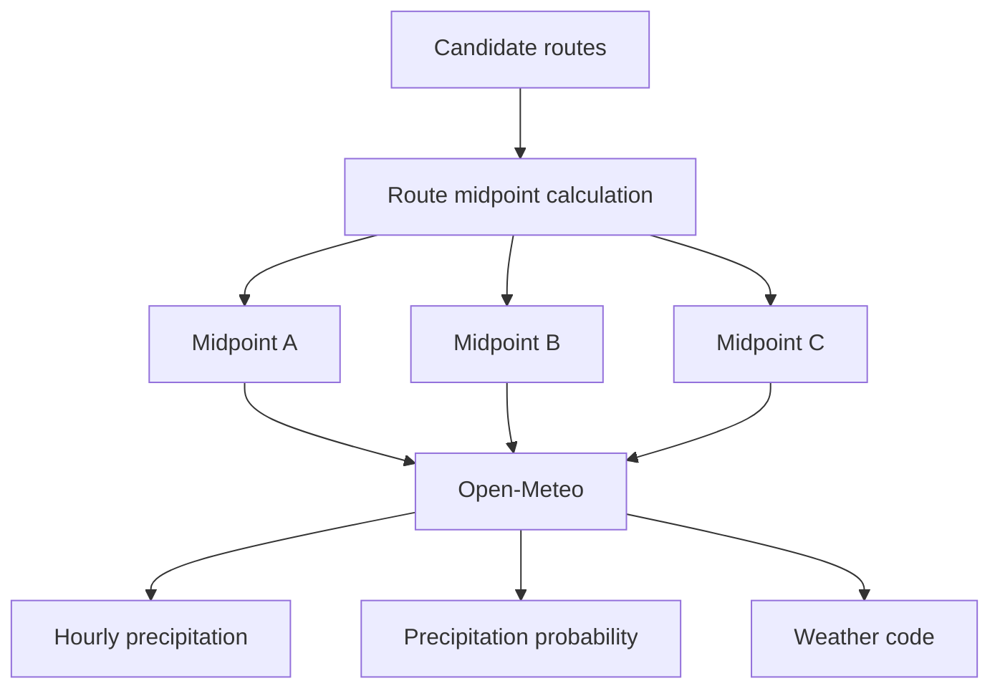

The weather analysis uses:

- precipitation;
- precipitation probability;
- weather code;
- `Asia/Kolkata` timezone.

The journey window is route-specific:

```text
journeyStart = departureTime
journeyEnd   = departureTime + route.durationSeconds
```

Open-Meteo hourly precipitation is treated as an interval rather than an instantaneous point. Only hourly intervals overlapping the journey window are considered.

---

# Waterlogging Intelligence

The waterlogging dataset is local and unified.

The application preserves the geometry supplied by authoritative sources:

- points remain points;
- polygons remain polygons.

A polygon is **not** replaced with its centroid and treated as a point.

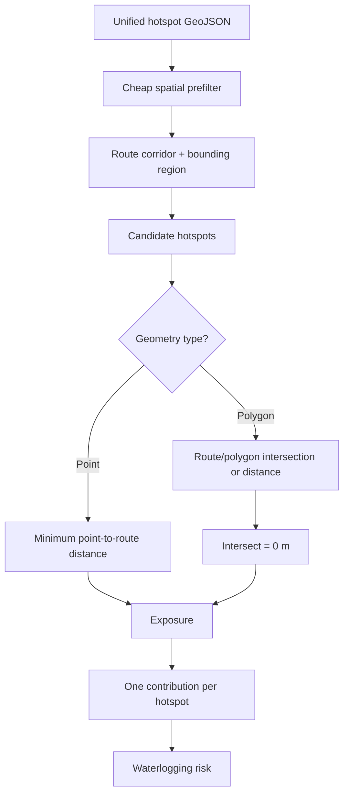

## UI optimization vs risk calculation

The UI may show approximately the **8–10 nearest hotspots** for nearby context.

That is only a presentation optimization.

The risk engine evaluates **all route-relevant hotspots**.

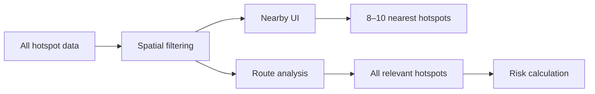

The two paths must not be confused.

---

# Risk and Decision Model

MonsoonRoute uses explicit deterministic formulas.

These scores are engineering heuristics and bounded exposure scores. They are **not flood probabilities** and do not establish absolute safety.

---

## Waterlogging risk

For every exposed hotspot, the conceptual contribution is:

```text
rawContribution =
    severityWeight
    × recurrenceFactor
    × proximityFactor
```

Severity:

```text
medium = 0.7
high   = 1.0
```

Recurrence:

```text
recurrenceFactor =
    min(
        1,
        log1p(documentedEventCount) / log1p(4)
    )
```

Proximity:

```text
proximityFactor =
    max(0, 1 - distanceMeters / 75)
```

The route corridor is:

```text
75 meters
```

This is an engineering analysis corridor, not a scientific flood radius.

All unique hotspot contributions are summed:

```text
totalContribution = sum(rawContribution)
```

Then:

```text
waterloggingRisk =
    100 × (1 - exp(-totalContribution))
```

The result is bounded from `0–100`.

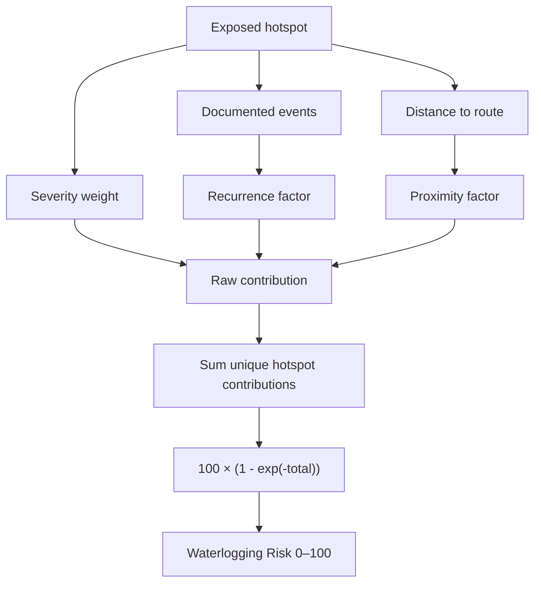

### One hotspot, one exposure

If a route passes near the same hotspot multiple times, that hotspot contributes **once per route**, using its minimum distance to the complete route.

This prevents artificial risk inflation caused by summing the same hotspot once per route segment.

---

## Rain risk

For each route:

```text
amountScore =
    clamp(totalPrecipitationMm / 15, 0, 1) × 100

peakScore =
    clamp(peakHourlyPrecipitationMm / 6, 0, 1) × 100

probabilityScore =
    averagePrecipitationProbability
```

Final rain risk:

```text
Rain Risk =
    0.50 × amountScore
  + 0.30 × peakScore
  + 0.20 × probabilityScore
```

Final score is clamped to `0–100`.

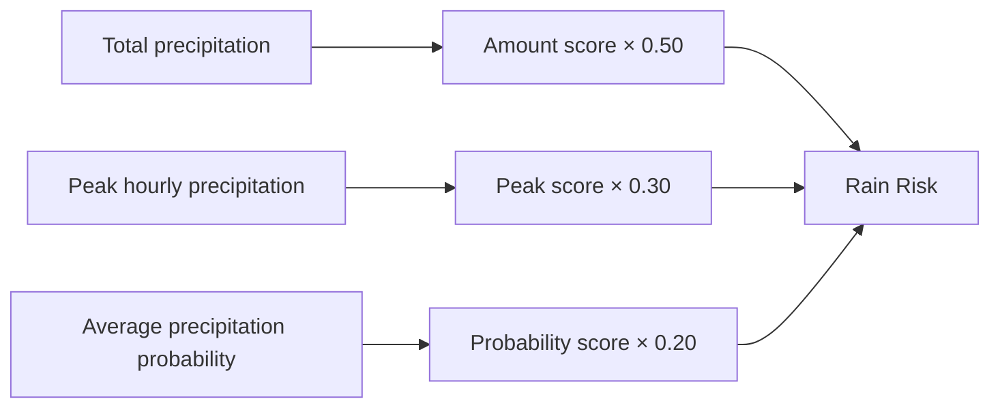

> Rain Risk is a **rain exposure/risk heuristic**, not flood probability.

---

## Environmental risk

Waterlogging is weighted more heavily because route-specific waterlogging evidence and geometry are the differentiating signals.

```text
Environmental Risk =
    0.70 × Waterlogging Risk
  + 0.30 × Rain Risk
```

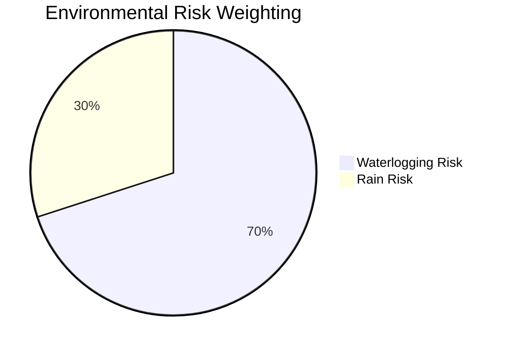

---

## Time penalty

The fastest available route establishes the baseline:

```text
fastestTime =
    minimum(route.durationSeconds)
```

For each route:

```text
delayRatio =
    (routeTime - fastestTime) / fastestTime

timePenalty =
    min(100, delayRatio × 100)
```

The fastest route therefore has:

```text
timePenalty = 0
```

---

## Decision score

The final score is:

```text
Decision Score =
    0.75 × Environmental Risk
  + 0.25 × Time Penalty
```

**Lower is better.**

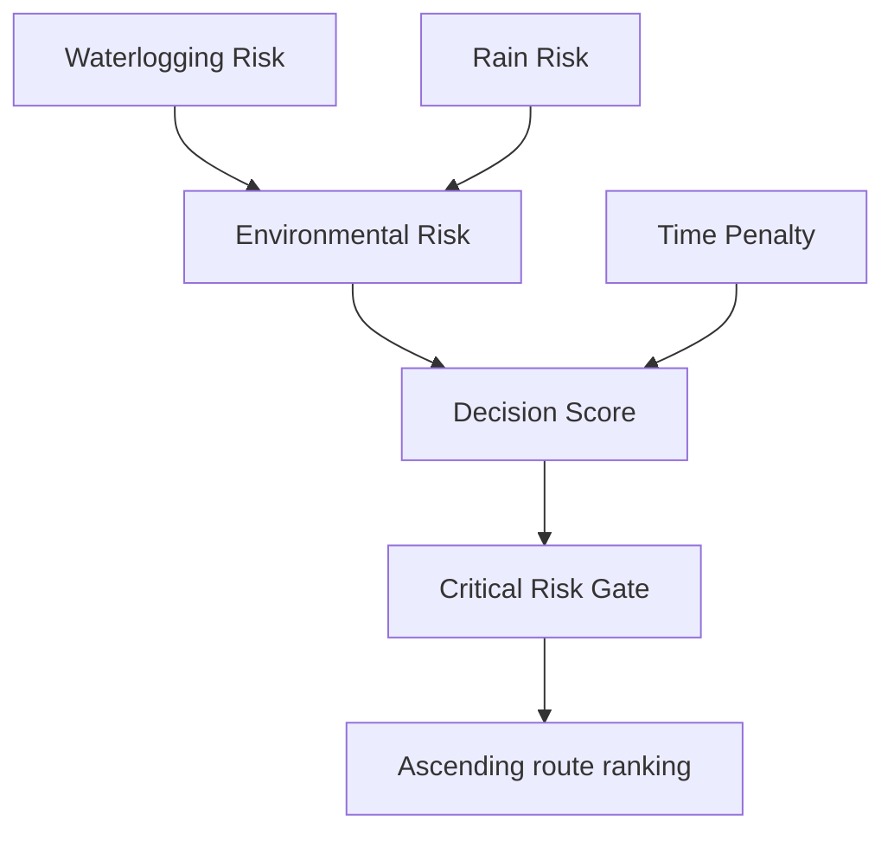

---

# Recommendation and Evidence

A route with environmental risk `>= 90` is considered **critical**.

```text
CRITICAL_ENVIRONMENTAL_RISK = 90
```

If at least one non-critical route exists, the system normally does not recommend a critical route.

If every route is critical, the system selects the lowest-risk available route.

It does not claim:

> "There is no safe route."

Instead it uses:

```text
lowest_risk_available
```

The normal tie-break order is:

```text
1. decision score
2. environmental risk
3. travel time
4. stable route order
```

All comparisons are ascending.

---

## Recommendation contract

Conceptually:

```ts
type RecommendationStatus =
  | "safer_option_found"
  | "lowest_risk_available";

type Recommendation = {
  recommendedRouteId: string;
  status: RecommendationStatus;
  reason: RecommendationReason;
};

type RecommendationReason = {
  timeDifferenceMinutes: number;
  environmentalRiskDifference: number;
  waterloggingRiskDifference: number;
  avoidedHighRiskHotspots: number;
  decisionScoreDifference: number;
};
```

---

## Evidence is deterministic

Evidence is generated before AI.

Example:

```text
Recommended Route B

+4 min vs fastest
2 high-risk hotspots avoided
lower waterlogging risk
heavy rain expected
lower environmental risk
```

Evidence categories include:

- waterlogging;
- rain;
- travel time.

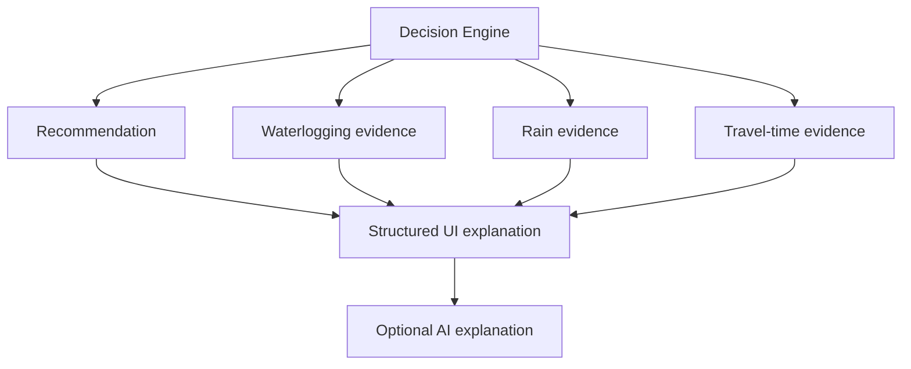

The user should be able to understand **why the route was recommended without AI**.

---

# AI Explanation Layer

The AI is deliberately constrained.

Its job is:

> **Explain an already-computed MonsoonRoute recommendation.**

It is not:

> "Choose the best route."

---

## AI boundary

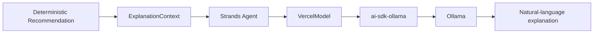

The agent receives only a small explanation context:

```text
recommendation
recommended route summary
fastest route summary
relevant evidence
```

It does **not** receive:

- raw Google responses;
- raw Open-Meteo responses;
- the entire hotspot dataset;
- route-calculation tools;
- weather tools;
- hotspot-search tools;
- map tools;
- risk-calculation tools;
- recommendation tools.

---

## AI rules

The agent must not:

- recalculate route risk;
- choose another route;
- modify scores;
- invent weather;
- invent hotspots;
- invent evidence;
- claim guaranteed safety;
- override the deterministic recommendation.

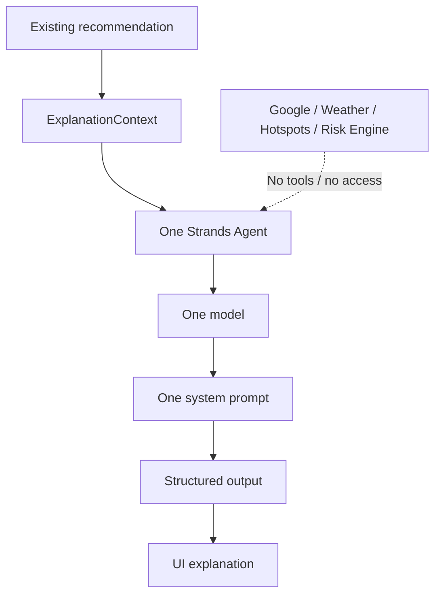

---

## Why Strands?

Environmental Hacks requires the project to visibly use an AWS-related technology path.

MonsoonRoute uses the **open-source Strands Agents SDK** for the AI explanation layer.

AWS fits here:

```text
AWS open-source component
        ↓
Strands Agents SDK
        ↓
AI explanation layer
```

The route decision remains deterministic.

No AWS cloud infrastructure is required merely to satisfy the hackathon.

---

## Ollama

The intended full AI demo path is local:

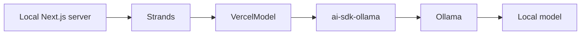

The full AI path assumes Ollama is available locally.

A deployed Next.js server must **not** be assumed to reach the developer laptop's `localhost`.

---

## AI failure fallback

AI is optional.

If Ollama is unavailable:

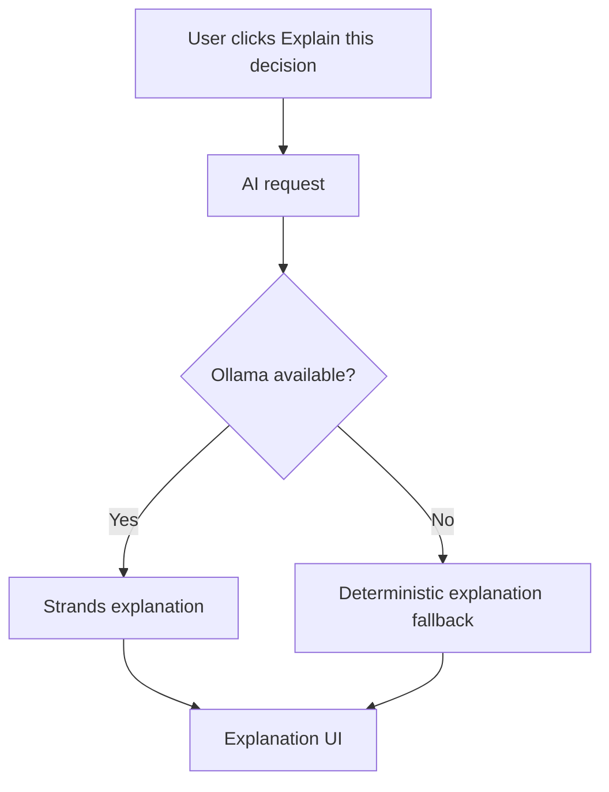

The core route-analysis product remains usable.

---

# Frontend Architecture

MonsoonRoute is intentionally a focused **single-page application experience**, not a multi-page dashboard.

Core UI flow:

```mermaid
flowchart TD
    A["Origin"] --> B["Destination"]
    B --> C["Travel mode"]
    C --> D["Find safer route"]
    D --> E["Interactive map"]
    E --> F["Recommended route"]
    F --> G["Alternative routes"]
    G --> H["Risk + evidence"]
    H --> I["Explain this decision"]
```

## Core components

```text
route-form.tsx
    → collect input and resolve places

route-map.tsx
    → render map, routes and hotspots

route-card.tsx
    → render candidate route

route-analysis.tsx
    → deterministic evidence and explanation

why-route.tsx
    → optional AI explanation
```

The frontend never recreates backend risk calculations.

---

## Visual hierarchy

The design system prioritizes:

```text
Recommendation
      ↓
Risk
      ↓
Evidence
      ↓
Comparison
      ↓
Details
```

The interface should feel:

- simple;
- readable;
- accessible;
- modern;
- calm;
- trustworthy;
- data-driven;
- dark-mode native.

It should not feel:

- flashy;
- game-like;
- neon;
- gradient-heavy;
- cluttered;
- dashboard-heavy;
- alarmist.

---

## Design tokens

Primary:

| Token | Value | Purpose |
|---|---|---|
| `primary` | `#3682F6` | Main actions / recommended route |
| `primary-hover` | `#2563EB` | Hover/pressed state |
| `primary-light` | `#60A5FA` | Highlights |
| `primary-subtle` | `#DBEAFE` | Light emphasis |

Semantic:

| Token | Value | Purpose |
|---|---|---|
| `success` | `#22C55E` | Recommended/success |
| `warning` | `#F59E0B` | Warning/moderate concern |
| `danger` | `#EF4444` | High risk/errors |

Surfaces:

| Token | Value |
|---|---|
| `background` | `#080F14` |
| `surface` | `#111827` |
| `surface-alt` | `#1F2937` |
| `border` | `#374151` |
| `muted-text` | `#9CA3AF` |
| `secondary-text` | `#D1D5DB` |
| `primary-text` | `#F9FAFB` |

Typography:

- Inter
- H1: 36px / bold
- H2: 28px / bold
- H3: 20px / semibold
- Body: 16px
- Caption: 14px
- Small: 12px

The design intentionally avoids large decorative gradients.

---

# Data Model and Geographic Scope

## Geographic scope

The unified hotspot dataset covers the supported Mumbai urban scope:

- Mumbai City;
- Mumbai Suburban;
- Navi Mumbai;
- Panvel / connected urban belt.

The dataset is source-backed and locally bundled as GeoJSON.

## Hotspot geometry

A canonical hotspot may contain:

- stable ID;
- name;
- geometry;
- representative location;
- authority/source;
- historical/current status;
- evidence;
- documented events;
- source references;
- provenance;
- relevant operational attributes where available.

The system must not fabricate:

- severity;
- probability;
- coordinates;
- event counts;
- evidence.

---

## Data pipeline

```mermaid
flowchart LR
    A["Authoritative / verified sources"] --> B["Source preparation"]
    B --> C["Reconciliation"]
    C --> D["Unified local GeoJSON"]
    D --> E["Runtime spatial filtering"]
    E --> F["Exact geometry analysis"]
    F --> G["Deterministic risk engine"]
```

At runtime, the application does not depend on a live municipal GIS service for every analysis.

---

## Location privacy

Browser geolocation is used only for the current application interaction.

Coordinates are not:

- persisted;
- stored;
- profiled;
- tracked;
- used for unrelated analytics.

If permission is denied, manual origin entry remains available.

---

# API

## `POST /api/analyze-route`

Request:

```json
{
  "origin": {
    "lat": 19.076,
    "lon": 72.8777
  },
  "destination": {
    "lat": 19.0596,
    "lon": 72.8295
  },
  "travelMode": "DRIVE",
  "departureTime": "2026-10-08T18:00:00+05:30"
}
```

Supported travel modes:

```text
DRIVE
TWO_WHEELER
```

Pipeline:

```mermaid
flowchart TD
    A["POST /api/analyze-route"] --> B["Parse JSON"]
    B --> C["Zod validation"]
    C --> D["Reject origin = destination"]
    D --> E["Google Routes"]
    E --> F["Normalize candidates"]
    F --> G["Route midpoint"]
    G --> H["Open-Meteo"]
    H --> I["Rain analysis"]
    F --> J["Hotspot candidate filtering"]
    J --> K["Exact geometry"]
    K --> L["Waterlogging analysis"]
    I --> M["Environmental risk"]
    L --> M
    F --> N["Time penalty"]
    M --> O["Decision score"]
    N --> O
    O --> P["Critical gate"]
    P --> Q["Recommendation"]
    Q --> R["Evidence"]
    R --> S["JSON response"]
```

### Error contract

| HTTP | Code | Meaning |
|---:|---|---|
| 400 | `INVALID_REQUEST` | Invalid input |
| 422 | `NO_ROUTE` | No candidate route exists |
| 502 | `ROUTING_PROVIDER_ERROR` | Google Routes failure |
| 502 | `WEATHER_PROVIDER_ERROR` | Open-Meteo failure |
| 500 | `ANALYSIS_ERROR` | Unexpected analysis failure |

If Google returns zero routes, MonsoonRoute does **not** fabricate a route or fall back to a straight line.

---

## `POST /api/explain-route`

The endpoint receives a small `ExplanationContext`.

Conceptually:

```ts
type ExplanationContext = {
  recommendation: Recommendation;

  recommendedRoute: {
    durationMinutes: number;
    environmentalRiskScore: number;
    waterloggingRiskScore: number;
    rainRiskScore: number;
    evidence: AnalysisEvidence[];
  };

  fastestRoute: {
    durationMinutes: number;
    environmentalRiskScore: number;
    waterloggingRiskScore: number;
    rainRiskScore: number;
  };
};
```

Pipeline:

```mermaid
flowchart LR
    A["POST /api/explain-route"] --> B["Zod"]
    B --> C["ExplanationContext"]
    C --> D["Strands Agent"]
    D --> E["VercelModel"]
    E --> F["ai-sdk-ollama"]
    F --> G["Ollama"]
    G --> H["{ explanation: string }"]
    H --> I["UI"]
```

This endpoint does not recalculate the route decision.

---

# Technology Stack

| Area | Technology |
|---|---|
| Framework | Next.js |
| UI | React |
| Language | TypeScript |
| Styling | Tailwind CSS |
| Package manager | pnpm |
| Validation | Zod |
| Maps | Google Maps JavaScript API |
| Map React integration | `@vis.gl/react-google-maps` |
| Places | Google Places / Autocomplete |
| Routing | Google Routes API |
| Weather | Open-Meteo Forecast API |
| Geometry | Turf.js |
| Local spatial data | GeoJSON |
| AI orchestration | `@strands-agents/sdk` |
| AI model adapter | `VercelModel` |
| Ollama adapter | `ai-sdk-ollama` |
| Local model runtime | Ollama |
| Unit/integration tests | Vitest |
| Black-box E2E | TestSprite |
| Live verification | Manual browser testing |

No additional infrastructure is required for the MVP.

---

# Project Structure

The conceptual structure is:

```text
monsoonroute/
│
├── docs/
│   ├── architecture.md
│   ├── design-system.md
│   ├── implementation-plan.md
│   ├── testing.md
│   └── demo.md
│
├── src/
│   ├── app/
│   │   ├── api/
│   │   │   ├── analyze-route/
│   │   │   │   └── route.ts
│   │   │   └── explain-route/
│   │   │       └── route.ts
│   │   ├── layout.tsx
│   │   ├── page.tsx
│   │   └── globals.css
│   │
│   ├── components/
│   │   ├── route-form.tsx
│   │   ├── route-map.tsx
│   │   ├── route-card.tsx
│   │   ├── route-analysis.tsx
│   │   └── why-route.tsx
│   │
│   ├── lib/
│   │   ├── config.ts
│   │   ├── validation.ts
│   │   ├── providers/
│   │   │   ├── google-routes.ts
│   │   │   ├── open-meteo.ts
│   │   │   └── strands.ts
│   │   ├── geo/
│   │   │   ├── route-geometry.ts
│   │   │   ├── hotspot-distance.ts
│   │   │   └── spatial-filter.ts
│   │   ├── analysis/
│   │   │   ├── rain-risk.ts
│   │   │   ├── waterlogging-risk.ts
│   │   │   ├── environmental-risk.ts
│   │   │   ├── time-penalty.ts
│   │   │   ├── decision-score.ts
│   │   │   └── recommendation.ts
│   │   ├── explanation/
│   │   │   └── deterministic-explanation.ts
│   │   └── utils/
│   │
│   ├── types/
│   │   ├── route.ts
│   │   ├── weather.ts
│   │   └── hotspot.ts
│   │
│   └── data/
│       └── mumbai-waterlogging-hotspots.geojson
│
├── tests/
│   ├── fixtures/
│   ├── unit/
│   ├── integration/
│   └── helpers/
│
├── testsprite/
│   ├── plans/
│   └── README.md
│
├── AGENTS.md
├── README.md
├── package.json
└── .env.local
```

The exact `src` convention may vary with the generated Next.js project, but the conceptual boundaries remain the same.

---

# Getting Started

## Prerequisites

The frozen implementation expects:

- Node.js 22+;
- pnpm;
- a Google Maps Platform setup for the required map/Places/Routes APIs;
- an Open-Meteo connection;
- Ollama for the optional full local AI path.

Strands' current TypeScript integration requires Node.js 22+.

---

## 1. Create the Next.js application

```bash
pnpm create next-app@latest monsoonroute
cd monsoonroute
```

Use:

- TypeScript: Yes
- ESLint: Yes
- Tailwind CSS: Yes
- `src/` directory: Yes
- App Router: Yes
- Turbopack: Yes
- import alias: `@/*`

---

## 2. Install application dependencies

Core:

```bash
pnpm add \
  @vis.gl/react-google-maps \
  @turf/turf \
  zod \
  @strands-agents/sdk \
  ai \
  ai-sdk-ollama
```

Testing:

```bash
pnpm add -D vitest @vitest/coverage-v8
```

The implementation should use current compatible package versions rather than obsolete Strands packages from older tutorials.

---

## 3. Start the development server

```bash
pnpm dev
```

Open:

```text
http://localhost:3000
```

---

## 4. Start Ollama for the AI path

The deterministic route-analysis system does not require Ollama.

For the optional AI explanation:

```bash
ollama serve
```

Then pull the model selected for the project:

```bash
ollama pull <model-name>
```

The default Ollama endpoint is:

```text
http://localhost:11434
```

---

# Environment Variables

Create:

```text
.env.local
```

Example:

```env
NEXT_PUBLIC_GOOGLE_MAPS_API_KEY=
GOOGLE_ROUTES_API_KEY=

OLLAMA_MODEL=
OLLAMA_BASE_URL=http://localhost:11434
```

Environment boundary:

```mermaid
flowchart LR
    B["Browser"] --> K1["NEXT_PUBLIC_GOOGLE_MAPS_API_KEY"]
    S["Next.js Server"] --> K2["GOOGLE_ROUTES_API_KEY"]
    S --> K3["OLLAMA_MODEL"]
    S --> K4["OLLAMA_BASE_URL"]
```

The server-side Routes key must never be exposed to the browser.

Do not commit `.env.local`.

---

# Google API and Cost Protection

Google APIs are the main externally billed component in the architecture.

The intended credential separation is:

```mermaid
flowchart LR
    K1["Browser key"] --> M["Maps JavaScript API"]
    K1 --> P["Places"]
    K2["Server key"] --> R["Routes API"]
```

Recommended protections:

1. enable only required Google APIs;
2. restrict both API keys;
3. configure conservative quotas where available;
4. avoid repeated automated route requests;
5. do not stress-test paid provider APIs;
6. use deterministic fixtures for most engine tests;
7. use real Google/Open-Meteo calls mainly for integration verification;
8. do not continuously poll providers;
9. do not create background jobs;
10. do not add AWS infrastructure just to increase architectural complexity.

One user analysis should use one Compute Routes request with alternatives rather than separate requests for every route.

---

# Testing Strategy

MonsoonRoute has four complementary testing layers.

```mermaid
flowchart TD
    A["Custom Unit Tests"] --> B["Mathematical / domain correctness"]
    B --> C["Custom Integration Tests"]
    C --> D["Provider + API + engine composition"]
    D --> E["Manual Browser Verification"]
    E --> F["Real external integrations"]
    F --> G["TestSprite"]
    G --> H["Black-box UI / API / E2E / regression"]
```

## Unit tests

Authoritative for:

- coordinate validation;
- route normalization;
- GeoJSON normalization;
- route midpoint calculation;
- weather interval normalization;
- partial-hour weighting;
- precipitation aggregation;
- hotspot distance;
- polygon intersection/distance;
- one-hotspot-one-exposure;
- recurrence;
- proximity;
- waterlogging risk;
- rain risk;
- environmental risk;
- time penalty;
- decision score;
- critical-risk gate;
- ranking;
- tie-breaking;
- recommendation reason;
- evidence;
- deterministic explanation;
- API error mapping;
- AI fallback.

---

## Integration tests

Use provider mocks:

```mermaid
flowchart LR
    G["Mock Google Routes"] --> R["Route normalization"]
    R --> W["Mock Open-Meteo"]
    W --> H["Hotspot dataset"]
    H --> GEO["Geometry"]
    GEO --> E["Risk engine"]
    E --> RK["Ranking"]
    RK --> REC["Recommendation"]
    REC --> EV["Evidence"]
    EV --> API["API response"]
```

This verifies that independently correct modules are also wired correctly.

---

## TestSprite

TestSprite is used for black-box product validation:

- page load;
- route form;
- destination selection;
- travel mode;
- current location;
- Find safer route;
- map rendering;
- route visibility;
- recommendation visibility;
- evidence;
- alternatives;
- Explain this decision;
- AI explanation;
- deterministic fallback;
- error states;
- regression.

TestSprite does **not** redefine mathematical formulas.

---

## Testing principle

The most important question is:

> **Given known route, weather, and hotspot inputs, does MonsoonRoute deterministically select the route that the frozen decision model says it should select?**

A green TestSprite run alone is not sufficient.

A green unit suite alone is not sufficient.

The combination provides confidence.

---

# Implementation Roadmap

The hackathon uses four calendar days, but only the first three are active implementation days.

```mermaid
gantt
    title MonsoonRoute Hackathon Execution
    dateFormat  YYYY-MM-DD
    axisFormat  %b %d

    section Implementation
    Day 1 - Foundation / Providers / Data :d1, 2026-10-08, 1d
    Day 2 - Decision Engine / Backend / Map :d2, 2026-10-09, 1d
    Day 3 - UI / AI / Integration :d3, 2026-10-10, 1d

    section Stabilization
    Day 4 - Testing / Bug Fixes / Demo / Submission :d4, 2026-10-11, 1d
```

## Day 1 — Foundation + Providers + Data

```text
Next.js
  ↓
Google Maps / Places
  ↓
Geolocation
  ↓
Shared contracts
  ↓
Validation
  ↓
Hotspot data
  ↓
Google Routes
  ↓
Route normalization
  ↓
Route midpoint
  ↓
Open-Meteo
```

Expected checkpoint:

```text
origin
  ↓
destination
  ↓
candidate routes
  ↓
route geometry
  ↓
route durations
  ↓
route midpoints
  ↓
weather snapshots
```

No recommendation is required yet.

---

## Day 2 — Deterministic Engine + Backend + Map

```text
Geometry
  ↓
Hotspot exposure
  ↓
Waterlogging risk
  ↓
Rain risk
  ↓
Environmental risk
  ↓
Time penalty
  ↓
Decision score
  ↓
Critical gate
  ↓
Ranking
  ↓
Recommendation
  ↓
Evidence
  ↓
/api/analyze-route
  ↓
Map
  ↓
Route cards
```

Expected checkpoint:

```text
Browser
  ↓
Find safer route
  ↓
Backend
  ↓
Recommendation
  ↓
UI
```

At this point the project already works without AI.

---

## Day 3 — Complete UI + AI Explanation

```text
Design system
  ↓
UI states
  ↓
Recommendation UI
  ↓
Evidence UI
  ↓
Responsive UI
  ↓
Deterministic explanation
  ↓
/api/explain-route
  ↓
Strands
  ↓
VercelModel
  ↓
ai-sdk-ollama
  ↓
Ollama
  ↓
Structured output
  ↓
AI fallback
  ↓
Full integration
```

---

## Day 4 — Testing + Stabilization + Submission

Day 4 is **not** a fourth feature-development day.

```text
Custom tests
  ↓
Integration tests
  ↓
TestSprite
  ↓
Manual browser verification
  ↓
Provider failure checks
  ↓
AI fallback
  ↓
Regression
  ↓
Demo verification
  ↓
README
  ↓
Attribution
  ↓
Recording
  ↓
Submission
```

No new product functionality should be planned for Day 4.

---

# Demo Flow

The final demo is designed to fit comfortably below three minutes.

The core story:

```mermaid
flowchart TD
    A["I need to travel from A to B"] --> B["Candidate routes"]
    B --> C["Rain + route geometry + waterlogging evidence"]
    C --> D["Deterministic risk analysis"]
    D --> E["Route ranking"]
    E --> F["Better trade-off"]
    F --> G["Evidence / Why"]
    G --> H["Explain this decision"]
    H --> I["Optional AI explanation"]
```

A planned rehearsal scenario is:

```text
Origin:      Andheri
Destination: Bandra
Mode:        DRIVE
```

This is a scenario target, not a promise about final live route numbers. The actual final build must be used.

The demo should visibly establish:

1. the problem;
2. origin/destination/travel mode;
3. candidate routes;
4. route comparison;
5. recommendation;
6. environmental risk;
7. waterlogging evidence;
8. rainfall evidence;
9. deterministic decision-making;
10. Explain this decision;
11. Strands / AWS role;
12. deterministic-vs-AI boundary.

### The key distinction

```text
DETERMINISTIC ENGINE
        ↓
ROUTE RECOMMENDATION
        ↓
USER CLICKS "EXPLAIN THIS DECISION"
        ↓
STRANDS + OLLAMA
        ↓
NATURAL-LANGUAGE EXPLANATION
```

AI must not be presented as the component that selected the route.

---

# Limitations and Safety

MonsoonRoute deliberately uses cautious language.

The system reports:

- estimated environmental risk;
- estimated waterlogging exposure;
- rainfall exposure;
- route trade-offs;
- source-backed evidence.

It does **not** prove:

- that a route is safe;
- that a route will not flood;
- an exact flood probability;
- emergency-road conditions;
- future traffic conditions.

For example:

Prefer:

> **Lower estimated waterlogging exposure.**

Not:

> **This route is definitely safer.**

If no hotspot is found within the 75 m analysis corridor, the evidence should say that no known hotspot from the MonsoonRoute dataset was found within the corridor.

It should not say:

> "This route will not flood."

---

# Definition of Done

The complete intended journey is:

```mermaid
flowchart TD
    A["Open MonsoonRoute"] --> B["Allow location OR enter origin"]
    B --> C["Enter destination"]
    C --> D["Select DRIVE / TWO_WHEELER"]
    D --> E["Find safer route"]
    E --> F["Google Routes"]
    F --> G["Route normalization"]
    G --> H["Route midpoint"]
    H --> I["Open-Meteo"]
    I --> J["Journey-window rain analysis"]
    G --> K["All route-relevant hotspots"]
    K --> L["Waterlogging risk"]
    J --> M["Environmental risk"]
    L --> M
    G --> N["Time penalty"]
    M --> O["Decision score"]
    N --> O
    O --> P["Recommendation"]
    P --> Q["Evidence"]
    Q --> R["Map + route cards + risk breakdown"]
    R --> S["Explain this decision"]
    S --> T["ExplanationContext"]
    T --> U["Strands"]
    U --> V["Ollama"]
    V --> W["Natural-language explanation"]
```

If Ollama fails:

```mermaid
flowchart LR
    A["Complete route analysis"] --> B["Recommendation"]
    B --> C["Evidence"]
    C --> D["Explain this decision"]
    D --> E["AI unavailable"]
    E --> F["Deterministic explanation fallback"]
    F --> G["Product remains usable"]
```

---

# Documentation

The repository keeps the implementation decisions explicit:

| Document | Purpose |
|---|---|
| [`docs/architecture.md`](docs/architecture.md) | System boundary and architecture |
| [`docs/design-system.md`](docs/design-system.md) | Visual language and UI rules |
| [`docs/implementation-plan.md`](docs/implementation-plan.md) | Execution order and implementation stages |
| [`docs/testing.md`](docs/testing.md) | Testing architecture and correctness requirements |
| [`docs/demo.md`](docs/demo.md) | Final demo and submission flow |
| [`AGENTS.md`](AGENTS.md) | Operational instructions for the coding agent |

Implementation order:

```mermaid
flowchart TD
    A["architecture.md"] --> B["design-system.md"]
    B --> C["implementation-plan.md"]
    C --> D["testing.md"]
    D --> E["demo.md"]
```

`AGENTS.md` is the operational execution layer: read the frozen documents, implement the current stage, verify it, mark it complete, and move to the next stage.

---

# Acknowledgements and Attribution

## Google Maps Platform

Used for:

- map rendering;
- Places / autocomplete;
- candidate route generation.

Google API credentials must be restricted appropriately and server-side route credentials must not be exposed to the browser.

## Open-Meteo

Used for:

- hourly precipitation;
- precipitation probability;
- weather information used in the route-analysis window.

Open-Meteo should be used according to its applicable usage terms, with required attribution included in the final project/submission.

## AWS Strands Agents SDK

Used as the AWS open-source component in the optional AI explanation layer.

Strands does not make the route decision.

## Turf.js

Used for:

- route geometry;
- spatial filtering;
- point-to-route distance;
- polygon intersection/distance;
- related geospatial calculations.

---

# Core Principle

Everything in MonsoonRoute follows one separation:

```mermaid
flowchart TB
    D["Source-backed data"] --> E["Deterministic analysis"]
    E --> R["Recommendation"]
    R --> V["Evidence"]
    V --> U["User"]
    U -->|"Explain this decision"| A["Strands"]
    A --> N["Natural-language explanation"]
```

The product does **not** ask an AI:

> "Which route should I take?"

It first determines the recommendation from explicit engineering rules and source-backed evidence.

Then, only when requested, it asks the AI:

> **"Explain why this already-computed decision was made."**

That separation is the core of MonsoonRoute.

---

## Built for Environmental Hacks 2026 — Heat & Water

**MonsoonRoute** is designed as a focused, explainable demonstration of how weather evidence, geospatial waterlogging data, deterministic decision logic, and an optional AI explanation layer can work together to help commuters make better route decisions during monsoon conditions.
